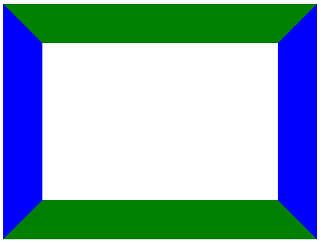

# css-triangles
Shows how to draw triangles using CSS

## Overview
CSS3 is a powerful system for formatting HTML elements, but sometimes it feels a little limiting when you want to do something that isn't strictly rectangular.  Sure, you can make a DIV tag have rounded corners with the `border-radius` attribute, but ultimately HTML and CSS are focused on blocks, and those blocks are rectangular.

Because of that, most triangles are rendered using image files or scalable vector graphics (SVG).  However, you can use pure CSS to create triangles of all sizes and shapes.  Let's look at how to accomplish that.

## It's All About the Borders
The `border-width` attribute of a DIV specifies the width of the border, obviously.  Setting that attribute will specify the width to be used on the left, right, top and bottom borders - it's shorthand for specifying each of those four attributes at once. But of course each of the four borders can have an individual width and color, which is the key to creating triangles.

Let's look at an example of a DIV with a very large border.  We'll color each of the four sides of the border a different color, so you can see how each border is drawn.

```
<style>
  .demo {
    width: 300px;
    height: 200px;
    border-width: 50px;
    border-style: solid;
    border-top-color: green;
    border-bottom-color: green;
    border-left-color: blue;
    border-right-color: blue;
  }
</style>
<div class='demo'></div>
```

The above code results in this:

Notice how the edges between the border sides are bevelled.  



Now let's see what it looks like when we only show one side of the border:

```
<style>
  .demo2 {
    width: 300px;
    height: 200px;
    border-width: 50px;
    border-style: solid;
    border-top-color: transparent;
    border-bottom-color: green;
    border-left-color: transparent;
    border-right-color: transparent;
  }
</style>
<div class='demo2'></div>
```


So that's starting to look somewhat like a triangle.  Let's try one more approach:

```
<style>
  .demo3 {
    width: 0px;
    height: 0px;
    border-bottom: 100px solid green;
    border-left: 50px solid transparent;
    border-right: 50px solid transparent;
  }
</style>
<div class='demo3'></div>
```

Notice that in this case we've changed our `width` and `height` to be 0, so the entire rendered shape is due to the borders alone.  We've also removed any elements relating to `border-top`.  This leaves the bottom border, which is 100 pixels high and green.  The left and right borders have a width (their combined width is the width of the base of the triangle), but their colors are set to `transparent`.

It's an odd idea, just defining three out of four borders, but it results in this very nice triangle:


In this case, our left and right borders had the same width.  They each contributed to the width of the base of the triangle.  Let's try making those widths unequal.

```
<style>
  .demo4 {
    width: 0px;
    height: 0px;
    border-bottom: 100px solid green;
    border-left: 40px solid transparent;
    border-right: 80px solid transparent;
  }
</style>
<div class='demo4'></div>
```

As you might expect, the resulting triangle is no longer equilateral:


Most practical uses of this will probably be to create equilateral triangles, since they work well as part of a larger arrow shape.  

## Summary

### Creating an upward pointing equilateral triangle:
1.  Define the bottom border with a non-transparent color and a width equal to the height of the triangle.
2.  Define the left and right borders, both transparent, both with a width equal to half the width of the base of the triangle.

### Creating an downward pointing equilateral triangle:
1.  Define the top border with a non-transparent color and a width equal to the height of the triangle.
2.  Define the left and right borders, both transparent, both with a width equal to half the width of the base of the triangle.

### Creating an leftward pointing equilateral triangle:
1.  Define the right border with a non-transparent color and a width equal to the height of the triangle.
2.  Define the top and bottom borders, both transparent, both with a width equal to half the width of the base of the triangle.

### Creating an upward pointing equilateral triangle:
1.  Define the left border with a non-transparent color and a width equal to the height of the triangle.
2.  Define the top and bottom borders, both transparent, both with a width equal to half the width of the base of the triangle.


## Authors
* **Greg Sommerville** - *Initial work* 
 
## License
This project is licensed under the Apache 2.0 License - see the [LICENSE.md](LICENSE.md) file for details